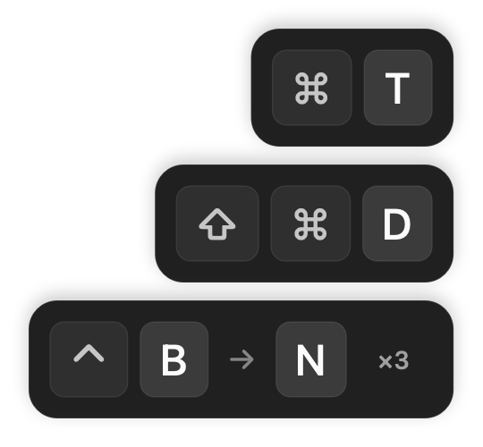

# Herdr 快捷键提示

[English](README.md) | **[中文](README.zh-CN.md)**

在 Herdr 完成操作后，显示对应的快捷键，帮助熟悉当前键位。支持工作区、标签页和窗格的常用操作；鼠标、键盘和 CLI 触发的操作都可提示。



macOS 使用原生键帽浮层，最多显示最近三组提示，每组停留 2 秒后淡出；连续重复操作显示 `×N`。浮层无声音、不抢焦点，鼠标可穿透。Linux 使用 Herdr 通知。

## 安装

需要 Herdr ≥ 0.9.0、Python ≥ 3.11 和 Git。macOS 首次安装还需要 Xcode Command Line Tools 中的 Swift 编译器；Python 部分仅依赖标准库。

确认信任本仓库后执行：

```sh
herdr plugin install circusvoid/herdr-key-hints --ref v0.1.0 --yes
herdr plugin action invoke local.key-hints.initialize
herdr plugin action invoke local.key-hints.preview
```

安装时自动检查依赖并编译 macOS 浮层，缺少依赖会终止安装。`preview` 显示“新建标签页”的当前快捷键；原生浮层仅在支持的终端应用位于前台时显示。之后新启动的 Herdr 服务器会自动初始化插件。

插件 ID 为 `local.key-hints`，可从 GitHub 正常安装。平台验收范围见[兼容性记录](docs/compatibility.md)。

## 配置

执行 `herdr plugin config-dir local.key-hints`，在输出目录中创建 `config.toml`：

```toml
enabled = true
renderer = "auto"
position = "bottom-right"
max_visible = 3
hold_ms = 2000
fade_ms = 200
```

`auto` 在 macOS 使用原生浮层，Linux 使用 Herdr 通知。原生浮层支持四角及上下居中，显示在鼠标所在屏幕；`max_visible` 可设为 1–5。终端应用、自定义 Herdr 配置路径等选项见[完整配置示例](config.example.toml)。可选的 Ghostty 键位配置见 [.config](.config/README.zh-CN.md)。

Linux 或 SSH 远端使用 `renderer = "herdr"`，并在 Herdr 配置中设置：

```toml
[ui.toast]
delivery = "herdr"
```

已有 `[ui.toast]` 时修改原表，再执行 `herdr server reload-config`。通知模式只支持四角位置，受 Herdr 通知限流和队列影响。

修改 `renderer` 后，先执行下方的 `stop`，待 `status` 显示暂停且原进程退出后再执行 `initialize`；其他显示参数会在后续操作时读取。修改 Herdr 键位后也需要重载 Herdr。

## 暂停、更新和卸载

```sh
herdr plugin action invoke local.key-hints.stop
herdr plugin action invoke local.key-hints.status
# 恢复当前会话
herdr plugin action invoke local.key-hints.initialize
```

更新时先暂停提示并等待进程退出，再用安装命令指定目标版本，完成后执行 `initialize`。卸载：

```sh
herdr plugin disable local.key-hints
herdr plugin uninstall local.key-hints
```

本地链接的版本使用 `herdr plugin unlink local.key-hints`，源码会保留。从本地链接切换到 GitHub 安装前，先暂停并 unlink。配置和状态位于 Herdr 提供的独立目录中。

## 功能边界

- 提示的是当前配置中的等效快捷键，不代表实际按下的键；显式禁用的绑定不会回退到默认键。
- 支持工作区和标签页的新建、关闭、切换、重命名，以及分屏、关闭或重命名窗格、放大或还原窗格、可明确推断的相邻窗格切换。
- 复杂布局变化可能无法识别，极快的连续操作可能合并；尚未覆盖分屏比例、窗格交换、侧栏、复制粘贴或终端应用自身的操作。
- 前台识别以终端应用为单位，不能区分同一应用中的不同会话窗口；SSH 不会自动在客户端启动原生浮层。

## 本地开发

```sh
git clone https://github.com/circusvoid/herdr-key-hints.git
cd herdr-key-hints
python3 plugin.py prepare
python3 plugin.py doctor
herdr plugin link "$PWD" --enabled
herdr plugin action invoke local.key-hints.initialize
```

本地 link 不执行构建；移动源码目录前先暂停，移动后重新 link 和 initialize。macOS 若只需通知模式，可用 `prepare --renderer herdr` 检查环境，再在插件配置中设置相同后端。

```sh
python3 -m unittest discover -s tests -v
python3 tests/smoke_herdr.py
python3 tests/smoke_overlay.py
python3 tests/smoke_install.py --ref v0.1.0
herdr plugin log list --plugin local.key-hints --limit 20
```

集成测试使用临时配置和独立 Herdr 会话。实现与验收限制见[兼容性记录](docs/compatibility.md)。

## 许可证

[MIT](LICENSE)。视觉结构参考 [Keyviz](https://github.com/mulaRahul/keyviz)，停留与淡出参数参考 [KeyCastr](https://github.com/keycastr/keycastr)；未包含这两个项目的源码或图片。
